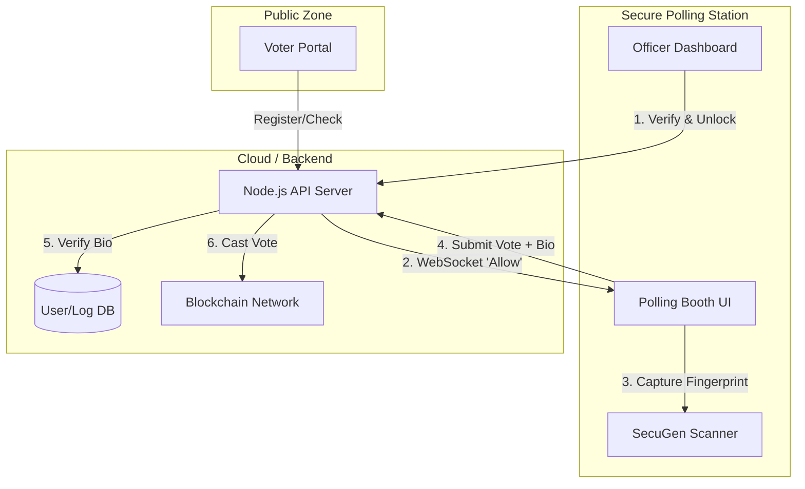

# VoteRakshak (Votraction) - Project Context

## 1. Project Overview

**Name:** VoteRakshak (also referred to as "Votraction")
**Core Concept:** A decentralized, biometric-secured electronic voting system designed to verify voter identity physically and record votes immutably.
**Aim:** To eliminate election fraud (such as booth capturing, double voting, and impersonation) by combining physical biometric verification with the transparency and immutability of blockchain technology.

## 2. Methodology

The system employs a "Defense in Depth" approach to election security:

1.  **Identity Verification:** Uses hardware-based fingerprint scanning (SecuGen) to ensure the person at the booth is the registered voter.
2.  **Access Control:** The polling booth is "locked" by default. It can only be unlocked by an authorized Election Officer via a separate dashboard after physical ID verification.
3.  **Data Privacy:** Aadhaar numbers are never stored or transmitted in plaintext. They are hashed using `keccak256` with a secret salt.
4.  **Immutable Record:** Votes are cast directly to a smart contract on the Ethereum blockchain (Ganache for dev), ensuring that once a vote is cast, it cannot be altered or deleted.
5.  **Distributed Architecture:** The system is split into isolated modules to prevent a single point of failure or compromise.

## 3. System Architecture

The project follows a modular microservices-like architecture with four distinct components:

| Component | Port | type | Purpose |
| :--- | :--- | :--- | :--- |
| **Voter Portal** | `5173` | React/Vite | Public-facing site for voters to register, check status, and find booths. |
| **Officer Dashboard** | `5174` | React/Vite | Admin interface for officials to verify identities and unlock booths. |
| **Polling Booth** | `5175` | React/Vite | Secure interface running on booth hardware. Handles voting and biometrics. |
| **Backend Server** | `5000` | Node.js | Central API handling auth, biometrics, and blockchain transactions. |

### Architecture Diagram

## 4. Workflows

### A. Voter Registration
1.  Voter visits **Voter Portal**.
2.  Enters details (Name, Aadhaar, etc.).
3.  Captures initial fingerprint (Registration Template).
4.  Backend hashes Aadhaar `keccak256(aadhaar + salt)` and stores user data + biometric template ID.

### B. Voting Process (The "Happy Path")
1.  **Arrival:** Voter arrives at the polling station.
2.  **Verification:** Election Officer asks for ID and checks **Officer Dashboard**.
3.  **Unlock:** Officer clicks "Unlock Booth" on their dashboard.
4.  **Activation:** Backend sends a WebSocket signal to the **Polling Booth**, changing it from "Idle" to "Voting Mode".
5.  **Selection:** Voter selects their preferred candidate/party on the touch screen.
6.  **Confirmation:** Voter places finger on the **SecuGen Scanner**.
7.  **Submission:** 
    *   Booth sends `(Aadhaar, PartyID, CapturedFingerprint)` to Backend.
8.  **Validation (Backend):**
    *   Hashes Aadhaar.
    *   Checks Blockchain: `hasVoted(voterHash)`?
    *   Verifies Biometrics: Matches trapped fingerprint against registered template.
9.  **Execution:**
    *   Backend calls Smart Contract: `castVote(voterHash, partyId)`.
    *   Blockchain records vote and emits `VoteCast` event.
10. **Completion:** Booth receives success message, shows Transaction Hash, and auto-resets to "Idle".

## 5. Technical Stack

*   **Frontend:** React.js, Vite, Tailwind CSS
*   **Backend:** Node.js, Express.js
*   **Database:** Supabase (Primary), local JSON (Fallback)
*   **Blockchain:** Ethereum (Solidity Smart Contract), Ganache (Local Chain), Ethers.js
*   **Biometrics:** SecuGen Hamster Pro 20 (Hardware), SGIBioSrv (Local Service)
*   **Communication:** Socket.io (Real-time control), REST API

## 6. Smart Contract Details

*   **Contract:** `DecentralizedVoting.sol`
*   **Privacy:** Uses `bytes32` mappings for voter status. No PII on chain.
*   **Integrity:** `voteCounts` are public but anonymous. `hasVoted` prevents double voting.
*   **Constraints:** Time-lock prevents voting before/after set times.

## 7. Current Status & Roadmap

**Implemented:**
*   ✅ Core Voting Logic (End-to-End)
*   ✅ Fingerprint Capture & Mock Verification
*   ✅ Blockchain Integration (Local Ganache)
*   ✅ WebSocket Real-time Control
*   ✅ Basic Officer Dashboard

**Pending / In Progress:**
*   🚧 Advanced Biometric Matching (Server-side)
*   🚧 Mainnet/Testnet Deployment
*   🚧 Comprehensive Analytics Dashboard
